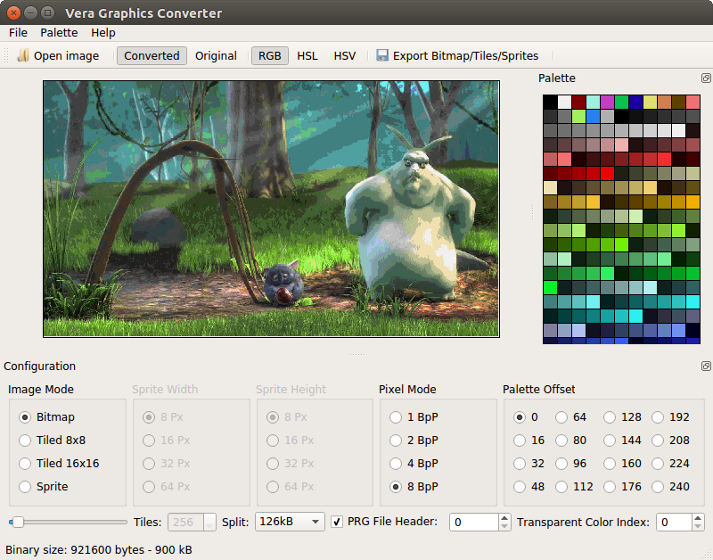

## Vera Graphics Converter (VGC)

This software converts indexed and RGBA images in the formats PNG, JPG or GIF into binary data suitable for the VERA chip in the upcoming 8-Bit Computer [Commander X16](https://www.commanderx16.com).

### Basic usage:

Open an image file using File/Open...

Configure the settings according to your needs.

Export the image using File/Export Bitmap/Tiles/Sprites...

### Image Modes:

You can open either an indexed image with an embedded palette or a regular RGBA image.

Depending on the image mode, the software behaves slightly differently.

#### RGBA:

In RGBA mode, VGC needs to match the pixel colors to the colors in the palette. This can be done by comparing color similarity in RGB (Red, Green, Blue), HSL (Hue, Saturation, Lightness) or HSV (Hue, Saturation, Brightness) mode. Select the conversion strategy that works best for your image. Ideally load a palette that matches all colors in the image.

You can specify the bit depth of the image by changing the pixel mode. 1 Bit per Pixel results in 2 colors, 2 Bits per Pixel result in 4 colors, 4 Bits per Pixel result in 16 colors and 8 Bits per Pixel uses the whole palette of 256 colors.

The colors usable by the image depend on the palette offset.

#### Indexed:

In indexed mode VGC assumes that all pixels in the image have the correct index. It is still necessary to select the correct palette offset to give a correct export. On export the palette offset is subtracted and the index value capped on the selected pixel mode.

#### Transparency

Any pixel in the image that has an alpha value of 255 is set to the index selected in "Transparent Color Index". The minimum value is the palette offset.

#### Image Mode:

The VERA Graphic chip has three modes. Bitmap, tiled with a tile dimension of 8 * 8 pixels and tiled with a tile dimension of 16 * 16 pixels. Both tile modes split the image in separate tiles and limit their number to 1024, since the VERA chip cannot address more than 1024 tiles. It is also possible to limit their number even further. In 2 color mode, only 256 tiles are supported.

To use a tile mode the width and height of your image must be divisible by 8 or 16.

The VERA chips supports 4 different resolutions: 640x480, 320x480, 640x240 and 320x240.
VGC does not enforce these resolutions. 

It is also possible to generate sprite maps. In sprite mode the tiles can have 8, 16, 32 or 64 pixels in width or height. They are however limited to 128 tiles, and similarly, the source images dimensions have to be divisible by the tile dimensions. Sprites can only have a color depth of 4 or 8 Bits per Pixel.

### The Palette

You can load and save the color palette in the Format used by the [Gnu Image Manipulation Program (GIMP)](https:://www.gimp.org)

Other software like [Aseprite](https://www.aseprite.org/) can read and save this format too.

You can also export the palette in the format used by the VERA chip. The PRG Header option is applied to this as well. The file splitting is not.

### Analyzing the image.

You can double click on colors in the palette to change them.

When you hold the left mouse button on a color in the palette, the parts of the image using this color are highlighted.

Similarly, when you click on the image the color in the palette is also highlighted. 

### Settings:

You can change some additional behavior under File/Settings...

#### PRG File Header

It is possible to save the exported binary file with 2 leading bytes. This is necessary for some load routines in the Commander X16 Kernal.

#### Splitting files

The exported files can be saved in chunks of a given size. The VERA Video RAM is paged in pages of 2048 bytes. Files can be split at any page, depending on how you want to store or load your data. The PRG File Header is saved to every individual file.
